# Automated Job Application Pipeline — System Design

## 1. System Architecture

### High-Level Dataflow

```mermaid
graph LR
    A["Source Monitor<br/>(Scrapers + APIs)"] -->|raw postings| B["Parse & Filter<br/>Engine"]
    B -->|matched jobs| C["Referral<br/>Checker"]
    C -->|enriched jobs| D["Resume Selector +<br/>LLM Drafting"]
    D -->|cover letter + best resume| E["Application Stager<br/>(Playwright)"]
    E -->|pre-filled browser session| F["YOUR SCREEN<br/>Review & Submit"]
    F -->|confirmation emails| I["Email Parser<br/>(Gmail API)"]
    I -->|status updates| G["State DB +<br/>Notifications"]
    B -->|all events| G
    G -->|alerts| H["Discord / SMS"]
```



### Proposed Stack

| Layer | Tool | Rationale |
|---|---|---|
| **Runtime** | Python 3.12+ | Ecosystem depth for scraping, NLP, automation |
| **Task Orchestrator** | Celery + Redis | Distributed task queue; retry/backoff built-in; beat scheduler for polling |
| **Browser Automation** | Playwright (persistent context) | Key difference: launches a **headed** (visible) browser with `persistent_context` so you see and control the final session |
| **HTTP Scraping** | `httpx` + `parsel` | Async HTTP client + fast CSS/XPath parsing for API-based sources |
| **Anti-Detection** | `playwright-stealth`, residential proxies | Only needed for scraping phase; staging phase is your real browser |
| **NLP / Filtering** | spaCy rule matcher + keyword scoring | Fast local inference; no API cost |
| **LLM Integration** | OpenAI `gpt-4o` or Claude via `litellm` | Provider-agnostic; easy fallback between providers |
| **Referral Network** | LinkedIn API (unofficial) + local cache | Cross-reference connections against matched companies |
| **State / DB** | SQLite → PostgreSQL via SQLAlchemy | Job tracking, dedup, audit trail |
| **Config / Secrets** | Pydantic Settings + `.env` | Typed config; secrets via env vars |
| **Email Parsing** | Gmail API (`gmail.readonly`) + `google-auth` | Parse confirmation, OA, interview, and rejection emails into status updates |
| **Notifications** | Discord webhook | Real-time alerts on new matches |
| **CLI / Dashboard** | Typer CLI + Streamlit | CLI for operations; Streamlit for review queue |
| **Deployment** | Local (dev Mac) or Docker on VPS | Scraping runs on VPS; staging opens on your local machine |

### Core Data Model

```python
class JobStatus(str, Enum):
    DISCOVERED = "discovered"
    MATCHED    = "matched"
    STAGED     = "staged"
    SUBMITTED  = "submitted"     # you clicked submit
    CONFIRMED  = "confirmed"     # confirmation email received
    OA_RECEIVED = "oa_received"  # online assessment link detected
    INTERVIEW  = "interview"     # interview invite detected
    OFFER      = "offer"
    REJECTED   = "rejected"      # rejection email detected
    SKIPPED    = "skipped"

class Job(Base):
    id: int
    source: str                   # "linkedin", "greenhouse:citadel", "lever:stripe", ...
    external_id: str              # dedup key
    title: str
    company: str
    url: str
    application_url: str          # direct link to the apply page
    description_raw: str
    description_clean: str
    relevance_score: float        # 0–1
    matched_keywords: list[str]
    role_category: str            # "quant", "tech" — drives resume selection
    status: JobStatus
    cover_letter_path: str | None # path to generated PDF
    resume_variant: str           # "quant" or "tech"
    resume_match_score: float     # confidence in variant selection
    referral_contacts: list[dict] # [{name, title, linkedin_url, degree}]
    staged_at: datetime | None
    submitted_at: datetime | None # you mark this manually
    confirmed_at: datetime | None # from email parser
    oa_deadline: datetime | None  # from email parser
    interview_date: datetime | None
    discovered_at: datetime
    error_log: str | None

class ResumeVariant(Base):
    id: int
    name: str                     # "quant", "tech"
    file_path: str                # path to PDF
    keywords: list[str]           # keywords this variant is optimized for
    description: str              # "Emphasizes stochastic calc, options pricing, C++"

class ReferralContact(Base):
    id: int
    name: str
    company: str
    title: str
    linkedin_url: str
    connection_degree: int        # 1 or 2
    last_synced: datetime

class EmailEvent(Base):
    id: int
    job_id: int | None            # FK → Job, null if unmatched
    gmail_message_id: str
    sender: str
    subject: str
    received_at: datetime
    event_type: str               # "confirmation", "oa", "interview", "rejection", "offer"
    extracted_data: dict          # {oa_link, deadline, interview_time, ...}
    processed_at: datetime
```

---

## 2. Implementation Phases

### Phase 0 — Scaffolding (1–2 days)
- [ ] Repo structure:
  ```
  src/
  ├── scrapers/          # one module per source
  ├── filters/           # keyword scoring + NLP
  ├── referrals/         # LinkedIn connection lookup
  ├── resumes/           # resume variant selection logic
  ├── drafting/          # LLM cover letter generation
  ├── stager/            # Playwright staging logic
  ├── email_tracker/     # Gmail API integration + status CRM
  ├── db/                # SQLAlchemy models + migrations
  ├── notifications/     # Discord webhooks
  ├── config/            # Pydantic settings
  └── cli/               # Typer CLI entrypoints
  ```
- [ ] Pydantic config: personal info schema (name, email, phone, university, GPA, grad date, work auth, skills, experiences, resume paths)
- [ ] SQLAlchemy models + Alembic
- [ ] `.env` template with all required secrets
- [ ] `pyproject.toml` with dependency groups

### Phase 1 — Source Monitoring (3–5 days)
- [ ] **API-based sources (no scraping needed):**
  - Greenhouse: `GET https://boards-api.greenhouse.io/v1/boards/{company}/jobs` — public JSON
  - Lever: `GET https://api.lever.co/v0/postings/{company}` — public JSON
  - Maintain a YAML config of target companies + their ATS type
- [ ] **Scraping-based sources:**
  - LinkedIn: authenticated session via saved `storage_state`; scrape `/jobs/search/` results
  - Handshake: `.edu` SSO auth state; scrape posting feeds
  - Workday / iCIMS / custom: Playwright per-company scrapers
- [ ] **Company config file:**
  ```yaml
  companies:
    - name: Jane Street
      ats: greenhouse
      board_id: janestreet
      priority: 1
    - name: Citadel
      ats: workday
      careers_url: https://www.citadel.com/careers/
      priority: 1
    - name: Google
      ats: custom
      careers_url: https://careers.google.com/jobs/results/
      search_params: {q: "new grad software engineer"}
      priority: 2
  ```
- [ ] Celery Beat scheduler: poll API sources every 5 min, scraping sources every 15 min
- [ ] Dedup on `(source, external_id)` — skip if already in DB

### Phase 2 — Filtering Engine (2–3 days)
- [ ] **Keyword taxonomy** (configurable in YAML):
  ```yaml
  include_title:    # weight: 3x
    - quant
    - quantitative
    - data scientist
    - software engineer
    - ML engineer
    - research
    - trading
  include_body:     # weight: 1x
    - Python
    - C++
    - stochastic calculus
    - probability
    - machine learning
    - linear algebra
    - statistics
  exclude:          # instant reject
    - senior
    - staff
    - principal
    - "10+ years"
    - director
    - VP
  require_any:      # must match ≥1
    - new grad
    - entry level
    - intern
    - "2025"
    - "2026"
    - early career
    - "0-2 years"
  ```
- [ ] Scoring: `score = (3 × title_hits + 1 × body_hits) / max_possible`, reject if any `exclude` match
- [ ] Thresholds: `≥ 0.6` → auto-queue for staging; `0.3–0.6` → manual review queue; `< 0.3` → skip
- [ ] Handle edge case: postings that omit seniority level → flag for manual triage, don't auto-reject

### Phase 3 — Referral Network Automation (3–4 days)
- [ ] **LinkedIn Connection Sync:**
  - Export connections via LinkedIn data export (Settings → Get a copy of your data) → parse `Connections.csv`
  - Alternatively: scrape your connections list via Playwright with auth state (riskier, but real-time)
  - Store in `ReferralContact` table with company normalization (fuzzy match company names)
- [ ] **Matching Logic:**
  - For each matched job, query `ReferralContact` where `company` fuzzy-matches `Job.company`
  - Surface 1st-degree connections first, then 2nd-degree
  - Attach to `Job.referral_contacts`
- [ ] **Referral Message Drafting:**
  - LLM-generated referral request, personalized to the contact's role:
    ```
    Hi {contact_name}, I saw that {company} has an opening for {job_title}.
    I'm a {degree} student at {university} with experience in {relevant_skills}.
    Would you be open to referring me or connecting me with the hiring team?
    ```
  - Stage the message in the dashboard — never auto-send
- [ ] **Dashboard Integration:**
  - Referral contacts displayed alongside each matched job
  - One-click to copy the drafted referral message
  - One-click to open the contact's LinkedIn profile

### Phase 4 — Resume Variant Selector + LLM Drafting (3–4 days)

#### 4a. Resume Variant Selector
- [ ] **Define two resume variants:**

  | Variant | Optimized For | Key Sections Emphasized |
  |---|---|---|
  | **Quant** (`quant.pdf`) | Quant research, trading, quant dev | Stochastic calculus, options pricing, statistical modeling, C++, probability theory, math competitions |
  | **Tech** (`tech.pdf`) | SWE, ML/AI, data engineering, big tech | Systems design, distributed systems, Python/Java, ML pipelines, open-source contributions, hackathons |

- [ ] **Selection logic** — score each variant against the JD:
  ```python
  # Each variant has a keyword set it's optimized for
  VARIANT_KEYWORDS = {
      "quant": ["quantitative", "trading", "stochastic", "options", "pricing",
               "risk", "derivatives", "fixed income", "alpha", "portfolio",
               "C++", "numerical", "probability", "statistics", "math"],
      "tech":  ["software engineer", "distributed", "systems", "API",
               "cloud", "kubernetes", "ML", "data pipeline", "backend",
               "frontend", "full stack", "Python", "Java", "Go", "scale"],
  }

  def select_variant(job: Job) -> tuple[str, float]:
      scores = {}
      jd = job.description_clean.lower()
      for variant, keywords in VARIANT_KEYWORDS.items():
          hits = sum(1 for kw in keywords if kw.lower() in jd)
          scores[variant] = hits / len(keywords)
      best = max(scores, key=scores.get)
      return best, scores[best]
  ```
- [ ] Store `Job.resume_variant` and `Job.resume_match_score`
- [ ] Edge case: if scores are within 0.05 of each other, flag for manual selection in dashboard
- [ ] Also set `Job.role_category` (`"quant"` or `"tech"`) — this drives cover letter tone as well

#### 4b. LLM Cover Letter Generation
- [ ] **Cover Letter Generation:**
  - System prompt with your background, target tone, and structural constraints
  - Tone varies by `role_category`:
    - **Quant**: emphasize mathematical rigor, research experience, quantitative competitions
    - **Tech**: emphasize engineering projects, scale, open-source, system design
  - Per-job prompt injects: `{job_title}`, `{company}`, `{job_description}`, `{matched_keywords}`, `{role_category}`
  - Output: 250–350 word letter, professional but specific to the role
  - Generate as markdown → convert to PDF via `weasyprint` (use a clean LaTeX-style template)
- [ ] **Free-Text Answer Drafting:**
  - Some portals ask "Why do you want to work at X?" or "Describe a project..."
  - Pre-generate 2–3 common answers, templated with company/role specifics
  - Staged as clipboard-ready text in the dashboard
- [ ] **Caching:** Hash `(company, job_title, description_hash)` → skip re-generation for similar roles

### Phase 5 — Application Stager (3–5 days)

This is the **core differentiator** from v1. Instead of submitting, we pre-fill and hand off.

- [ ] **Persistent Browser Context:**
  ```python
  # Launch a VISIBLE browser with your real profile data
  context = await playwright.chromium.launch_persistent_context(
      user_data_dir="./browser_profile",
      headless=False,       # YOU see the browser
      viewport={"width": 1440, "height": 900},
  )
  ```
  - Pre-logged into LinkedIn, Handshake, Workday, etc. via saved session
  - Your real cookies, extensions, and fingerprint — zero bot detection risk

- [ ] **Staging Workflow:**
  1. Open the `application_url` in a new tab
  2. Wait for the form to load
  3. Auto-fill fields using heuristic label matching:
     - Detect `<input>`, `<select>`, `<textarea>` elements
     - Match labels/placeholders to your personal info schema
     - Fill via `page.fill()` and `page.select_option()`
  4. Upload resume via `page.set_input_files()` using the selected variant
  5. If cover letter upload exists, attach the generated PDF
  6. Paste any free-text answers
  7. **STOP before Submit** — play a notification sound + Discord ping
  8. Tab stays open for your review; you fix any mis-fills and click Submit

- [ ] **Batch Staging Mode:**
  - CLI command: `python -m src.cli stage --batch 10`
  - Opens 10 applications in separate tabs, all pre-filled
  - You tab through, review each, submit, and mark as done
  - Status updates to `SUBMITTED` when you confirm in CLI/dashboard

- [ ] **Field Mapping Heuristics:**
  ```python
  FIELD_MAP = {
      r"first.?name": personal.first_name,
      r"last.?name": personal.last_name,
      r"email": personal.email,
      r"phone": personal.phone,
      r"university|school|college": personal.university,
      r"gpa|grade": personal.gpa,
      r"graduat": personal.graduation_date,
      r"work.?auth|sponsor|visa": personal.work_authorization,
      r"linkedin": personal.linkedin_url,
      r"github": personal.github_url,
  }
  ```
  - Match against: `label[for]`, `aria-label`, `placeholder`, `name` attribute
  - Log confidence per field; highlight low-confidence fills in the dashboard

- [ ] **Clipboard Integration:**
  - For fields that resist programmatic fill (e.g., React-controlled inputs), copy value to clipboard + show a toast: "Paste into {field_name}"

### Phase 6 — Notifications & Dashboard (2–3 days)
- [ ] **Discord Webhooks:**
  - `NEW_MATCH`: "🎯 **Jane Street — Quantitative Researcher (New Grad)** — Score: 0.87 — Resume: quant — Referral: John Doe (1st°)"
  - `STAGED`: "📋 Application staged — 3 tabs open, ready for review"
  - `STATUS_CHANGE`: "📧 **Google SWE** status: SUBMITTED → OA_RECEIVED — Deadline: May 5"
  - `DAILY_DIGEST`: Summary of new postings, staged apps, submitted count, pipeline funnel
- [ ] **Streamlit Dashboard:**
  - **Review Queue**: Table of matched jobs, sortable by score/company/date
  - **Job Detail Panel**: JD, matched keywords, referral contacts, cover letter preview, selected resume variant
  - **Actions**: "Stage Now", "Skip", "Mark Submitted", "Edit Cover Letter", "Override Resume Variant"
  - **Pipeline View**: Kanban-style board: Matched → Staged → Submitted → OA → Interview → Offer/Rejected
  - **Stats**: Applications by status, by company, by week; resume variant distribution; referral conversion rate

### Phase 7 — Email Parser & Application Status CRM (3–4 days)

Closes the loop from submission → outcome tracking with zero manual data entry.

- [ ] **Gmail API Setup:**
  - OAuth2 with `gmail.readonly` scope via Google Cloud Console
  - Credentials stored in `.env` / secure keychain
  - Poll every 5 min via Celery Beat (or use Gmail push notifications via Pub/Sub for real-time)
- [ ] **Email Classification Pipeline:**
  ```python
  # Pattern-based classifier with LLM fallback
  EMAIL_PATTERNS = {
      "confirmation": [
          r"application.*(received|confirmed|submitted)",
          r"thank you for (applying|your interest)",
          r"we have received your application",
      ],
      "oa": [
          r"(hackerrank|codesignal|hirevue|codility)\.com",
          r"online assessment",
          r"coding (challenge|test)",
      ],
      "interview": [
          r"(schedule|invite).*(interview|phone screen|onsite)",
          r"next (round|step|stage)",
      ],
      "rejection": [
          r"(unfortunately|regret|not moving forward)",
          r"will not be (proceeding|advancing)",
          r"other candidates",
      ],
      "offer": [
          r"(pleased|excited) to (offer|extend)",
          r"offer letter",
      ],
  }
  ```
- [ ] **Job Matching:**
  - Match incoming emails to `Job` records by fuzzy-matching `sender` domain → `Job.company` and `subject` → `Job.title`
  - Unmatched emails flagged for manual linking in the dashboard
- [ ] **Data Extraction:**
  - OA emails: extract assessment URL + deadline via regex
  - Interview emails: extract proposed dates/times, interviewer names
  - Store in `EmailEvent.extracted_data` as JSON
- [ ] **Automated Actions on Status Change:**
  - `OA_RECEIVED`: Create Google Calendar event with deadline via Calendar API
  - `INTERVIEW`: Create calendar event with interview details
  - `REJECTED`: Auto-archive; update dashboard stats
  - All transitions → Discord notification
- [ ] **Dashboard Integration:**
  - Email timeline per job: see every email exchange in chronological order
  - Pipeline funnel metrics: % conversion at each stage (Applied → OA → Interview → Offer)
  - Deadline alerts: upcoming OA deadlines sorted by urgency

---

## 3. Feature Expansion (Beyond Core)

### 3a. Application Timing Optimizer
Track `submitted_at` timestamps vs. outcomes. Hypothesis: apps submitted within the first 48 hours of posting have higher response rates. Use this data to prioritize the staging queue by posting age.

### 3b. JD Change Detection
Some companies silently update JDs (e.g., changing "3+ years" to "0-2 years" or adding new locations). Diff each scrape against the stored `description_raw`. Alert on material changes to previously-skipped postings.

### 3c. Portfolio Link Injection
For applications with a "portfolio" or "website" field, auto-generate a personalized one-pager via GitHub Pages that highlights projects relevant to the specific JD. Templated HTML + LLM-selected project descriptions.

---

## 4. Risk Mitigation

> [!TIP]
> The semi-automated model **dramatically** reduces anti-bot risk. The scraping phase is the only automated external interaction, and the staging phase uses your real browser profile. Most of the v1 anti-bot complexity is now unnecessary.

### 4a. Scraping Phase (Automated — Moderate Risk)

| Technique | Implementation |
|---|---|
| **Prefer APIs over scraping** | Greenhouse + Lever = free JSON APIs. Use them. Scrape only when no API exists. |
| **Residential proxies** | BrightData / Smartproxy for LinkedIn and Workday scraping. ~$15/mo for this volume. |
| **Rate limiting** | Max 1 request/3s per source. Celery rate limits: `@task(rate_limit="20/m")` |
| **Session reuse** | Save `storage_state` for authenticated sites. Avoid re-login per cycle. |
| **`playwright-stealth`** | Patches webdriver detection. Only needed for scraping, not staging. |
| **User-Agent pool** | 10–15 real Chrome UAs, rotated per session. |

### 4b. Staging Phase (Semi-Manual — Near-Zero Risk)

| Concern | Why It's Not a Problem |
|---|---|
| **Bot detection** | You're using a real, headed browser with your real cookies. You ARE the user. |
| **CAPTCHA** | You solve them yourself during the review step. No solver API needed. |
| **Dynamic DOM** | You see the page. If auto-fill misses a field, you fill it manually. |
| **ToS violations** | Manual submission = fully compliant with every platform's ToS. |

### 4c. Resilience Patterns (Scraping Layer)
- **Retry with backoff**: Celery `autoretry_for=(HTTPError,)`, `retry_backoff=True`, `max_retries=3`
- **Circuit breaker**: >5 consecutive failures on a source → pause + Discord alert
- **Screenshot on failure**: `page.screenshot()` for debugging scraping errors
- **Idempotency**: Dedup on `(source, external_id)` before insert; skip already-matched jobs
- **Graceful degradation**: If LinkedIn scraping fails, the system still runs on API sources

---

## 5. Timeline

| Phase | Duration | Cumulative |
|---|---|---|
| P0: Scaffolding | 1–2 days | 2 days |
| P1: Source Monitoring | 3–5 days | 7 days |
| P2: Filtering | 2–3 days | 10 days |
| P3: Referral Network | 3–4 days | 14 days |
| P4: Resume Selector + LLM Drafting | 3–4 days | 18 days |
| P5: Application Stager | 3–5 days | 23 days |
| P6: Notifications + Dashboard | 2–3 days | 26 days |
| P7: Email Parser + Status CRM | 3–4 days | 30 days |
| **Total MVP** | | **~4–5 weeks** |

> [!TIP]
> **Suggested build order for fastest time-to-value**: P0 → P1 (Greenhouse/Lever APIs only) → P2 → P4 (resume selector + basic cover letter) → P5 (basic staging). This gets you a working scrape → filter → select resume → pre-fill loop in ~12 days. Add referrals (P3), dashboard (P6), and email tracking (P7) incrementally.

> [!NOTE]
> **P7 can run independently** once you start manually submitting applications. Even before the stager is built, you can deploy the email parser against your Gmail to start tracking statuses of applications you submit manually. Consider starting it in parallel with P5.
